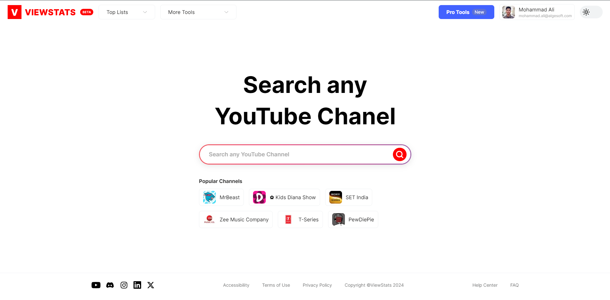

# ViewStats Clone

 

This is dummy & testing project of integrating Nest JS backend API's. All of the API's are integrated with RTK Query and the state managed with Redux Toolkit. (Right Now Only 'MrBeast' Channel has daily views & daily subscribers data. Others channel doesn't have that data yet!)

### Visit Here: [https://viewstats-xi.vercel.app/](https://viewstats-xi.vercel.app/)

 

## Resources:

- Frontend Code: [https://github.com/algesoft-ali/viewstats](https://github.com/algesoft-ali/viewstats)
- Backend Code: [https://github.com/algesoft-ali/viewstats_server](https://github.com/algesoft-ali/viewstats_server)

 

## Features:

- Social Media Login (Google).
- Light Mode & Dark Mode.
- Channel Analytics by Daily Views, Daily Subscribers.
- Channel Analytics Filtering.
- Search channels to view analytics
- Popular channels

## Technologies:

**Frontend:**

- Next JS
- Typescript
- Tailwind CSS
- Redux Toolkit
- RTK Query
- React ECharts
- Cookies-next

 

**Backend:**

- Nest JS
- Typescript
- Mongoose
- MongoDB
- JWT
- Passport JS
